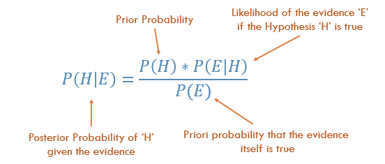

## 1. Statistical Feature
* Helps in exploring a dataset to gain valuabe insights such as bias, variance, mean, median and many other.
* **Boxplot**
	* 
	* Short - Data points are similar
	* Tall - There is much variety in data/spread over wide range
	* Median
		* Close to bottom, most of the data has lower values
		* Close to top, most of the data has higher values
		* Not in the middle, data is skewed
		* Whiskers are very long, data has high standard deviation and variance

## 2. Probability Distribution
* It defines the percent change that some event will occur, and we can use them to understand the spread of data.
* **Uniform Distribution**
	* 
* **Normal Distribution**
	* a.k.a. Gaussian Distribution
	* Mean shifts distribution spatially
	* Standard Deviation controls the spread
	* 

* **Poisson Distribution**
	* Similar to Normal, with added factor of skewness
	* Low value, uniform spread, why?
	* high spread with different in different direction.
	* 

## 3. Bayesian Statistics
* Bayesian Statistics expresses probability as a degree of belief in an event which can change as new information is gathered rather than a fixed value based on frequency.
* It is useful since Frequency Statistics only works with prior data
* Use it whenever you feel that your prior data will not be a good representation of your future data and results.
* 

## 4. Dimensionality Reduction
* Projecting 3D data onto a 2D plane
* Reducing unimportant features
* Principal Component Analysis, most popular

## 5. Over and Under Sampling
* **Undersampling**
	* Selecting less data of the majority class to maintain probability distribution
	* 

* **Oversampling**
	* Creating copies of minority class to maintain the distribution.
	* 
